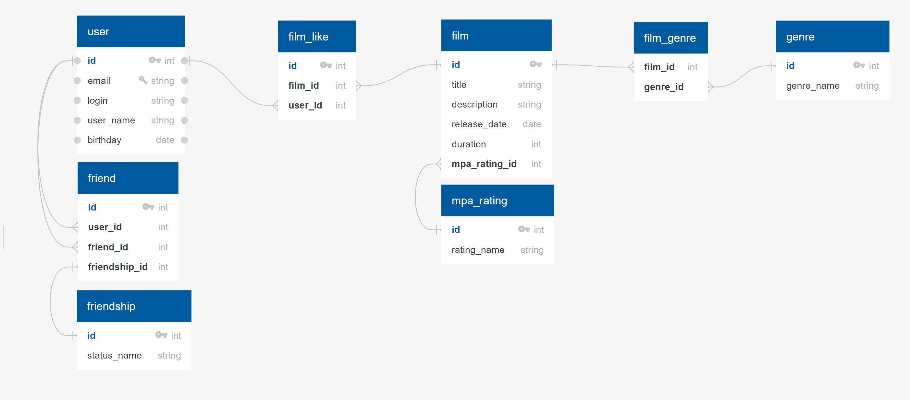

## Entity relations table for filmorate database

---
### База данных состоит из следующих таблиц:
1. __user__:
   -  *id* (первичный ключ)
   -  *email* (электронная почта пользователя)
   -  *login* (логин пользователя)
   -  *user_name* (имя пользователя)
   -  *birthday* (дата рождения пользователя)

2. __friendship__:
   - *id* (первичный ключ)
   - *status_name* (статус, например, 'Ожидает подтверждения', 'В друзьях')
3. __friends__:
    - *id* (первичный ключ)
    - *user_id (внешний ключ, содержит id пользователя из таблицы __user__)
    - *friend_id* (внешний ключ, содержит id пользователя из таблицы __user__, который является другом пользователя c идентификатором *user_id*)
    - *friendship_id* (внешний ключ, содержит id статуса дружбы из таблицы __friendship__)
4. __mpa_rating__:
   - *id* (первичный ключ)
   - *rating_name* (навзвание возрастного рейтинга) 
5. __film__:
   - *id* (первичный ключ)
   - *title* (название фильма)
   - *description* (опсисание фильма)
   - *release_date* (дата релиза фильма)
   - duration (длительность фильма в минутах)
   - *mpa_rating_id* (внешний кллюч, содержит id возрастного рейтинга из таблицы __mpa_rating__)
6. __genre__:
   - *id* (первичный ключ)
   - *genre_name* (название жанра фильма)
7. __film_genre__ (соединительная таблица между __film__ и __genre__):
   - *film_id* (внешний ключ, содержит id фильма из таблицы __film__)
   - *genre_id* (внешний ключ, содержит id жанра из таблицы __genre__)
8. __film_likes__ (содержит список лайков фильмов от пользователей):
   - *id* (первичный ключ)
   - *film_id* (внешний ключ, содержит id фильма из таблицы __film__)
   - *user_id (внешний ключ, содержит id пользователя из таблицы __user__)
---

### Примеры запросов для основных операций:
- *добавление пользователя*
&emsp;&emsp;__INSERT INTO__ user (email, login, user_name, birthday)

&emsp;&emsp;__VALUES__ ('test@email.ru', 'test_login', 'test_user_name', DATE '2000-01-01');

   
- *обновление пользователя*
  
&emsp;&emsp;__UPDATE__ user __SET__ user_name = 'new_user_name' __WHERE__ email = 'test@email.ru';

- *получение списка всех пользователей*

&emsp;&emsp;__SELECT__ * __FROM__ user;

- *получение пользователя по id*
  
&emsp;&emsp;__SELECT__ * __FROM__ usere __WHERE__ id = 1;

- *добавление пользователя с id '1' в друзья пользователю с id '2' с id статуса дружбы '1'*
  
&emsp;&emsp;__INSERT INTO__ friends (user_id, friend_1, friendship_id)

&emsp;&emsp;__VALUES__ (2, 1, 1);

- *получение списка друзей пользователя с id 1*
  
__SELECT__ * __FROM__ user __WHERE__ id __IN__ (__SELECT__ friend_id __FROM__ friends __WHERE__ user_id = 1);

- *получение списка общих друзей между пользователей с id 1 и 2*
  
&emsp;&emsp;__SELECT__ * __FROM__ user __WHERE__ id __IN__ (

&emsp;&emsp;&emsp;&emsp;__SELECT__ u1.friend_id

&emsp;&emsp;&emsp;&emsp;__FROM__ friends __AS__ u1, friends __AS__ u2

&emsp;&emsp;&emsp;&emsp;__WHERE__ u1.user_id = 1 __AND__ u2.user_id = 2 __AND__ u1.friend_id = u2.friend_id);

- *удаление пользователя из списка друзей*

&emsp;&emsp;__DELETE__ friends __WHERE__ user_id = 1 __AND__ friend_id = 2;

- *добавление фильма*

&emsp;&emsp;__INSERT INTO__ film (title, description, release_date, duration, genre_id)

&emsp;&emsp;__VALUES__ ('film_title', 'film_description', DATE '2010-10-10', 123, 1);

- *обновление фильма*

&emsp;&emsp;__UPDATE__ film __SET__ description = 'new_description' __WHERE__ title = 'film_title';

- *получение списка всех фильмов*

&emsp;&emsp;__SELECT__ * __FROM__ film;

- *получение списка по id*

&emsp;&emsp;__SELECT__ * __FROM__ film __WHERE__ id = 1;

- *добавить лайк фильму*

&emsp;&emsp;__INSERT INTO__ film_likes (filmd_id, user_id)

&emsp;&emsp;__VALUES__ (1, 1);

- *удалить лайк*

&emsp;&emsp;__DELETE__ film_likes __WHERE__ filmd_id = 1 __AND__ user_id = 1; 

- *получить 10 самых популярных фильмов*

&emsp;&emsp;__SELECT__ title __FROM__ film __WHERE__ id __IN__ (

&emsp;&emsp;&emsp;&emsp;__SELECT__ film_id __FROM__ film_likes __GROUP BY__ film_id __ORDER BY__ __COUNT__(*) __DESC__

&emsp;&emsp;) __LIMIT__ 10;

