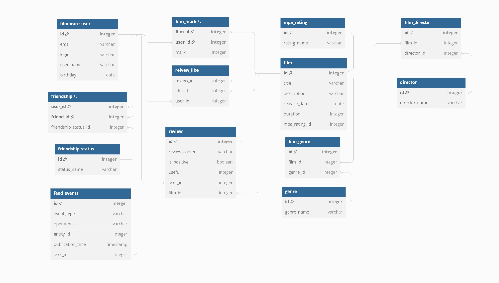

## Entity relations table for filmorate database

---
### База данных состоит из следующих таблиц:
1. __filmorate_user__:
    -  *id* (первичный ключ)
    -  *email* (электронная почта пользователя)
    -  *login* (логин пользователя)
    -  *user_name* (имя пользователя)
    -  *birthday* (дата рождения пользователя)
2. __friendship_status__:
    - *id* (первичный ключ)
    - *status_name* (статус, например, 'Ожидает подтверждения', 'В друзьях')
3. __friendship__:
    - *user_id* (составной первичный ключ, внешний ключ, содержит id пользователя из таблицы __user__)
    - *friend_id* (составной первичный ключ, внешний ключ, содержит id пользователя из таблицы __user__, который является другом пользователя c идентификатором *user_id*)
    - *friendship_id* (внешний ключ, содержит id статуса дружбы из таблицы __friendship__)
4. __mpa_rating__:
    - *id* (первичный ключ)
    - *rating_name* (навзвание возрастного рейтинга)
5. __film__:
    - *id* (первичный ключ)
    - *title* (название фильма)
    - *description* (опсисание фильма)
    - *release_date* (дата релиза фильма)
    - duration (длительность фильма в минутах)
    - *mpa_rating_id* (внешний кллюч, содержит id возрастного рейтинга из таблицы __mpa_rating__)
6. __genre__:
    - *id* (первичный ключ)
    - *genre_name* (название жанра фильма)
7. __film_genre__ (соединительная таблица между __film__ и __genre__):
    - *film_id* (составной первичный ключ, внешний ключ, содержит id фильма из таблицы __film__)
    - *genre_id* (составной первичный ключ, внешний ключ, содержит id жанра из таблицы __genre__)
8. __film_mark__ (содержит список оценок фильмов от пользователей):
    - *film_id* (составной первичный ключ, внешний ключ, содержит id фильма из таблицы __film__)
    - *user_id* (составной первичный ключ, внешний ключ, содержит id пользователя из таблицы __user__)
    - *mark* (оценка фильма)
9. __review__
    - *id* (первичный ключ)
    - *review_content* (содержание отзыва)
    - *is_positive* (является ли отзыв положительным)
    - *useful* (количество положительных лайков отзыва)
    - *user_id* (идентификатор пользователя, который написал отзыв)
    - *film_id* (идентификатор фильма, о котором напсисан отзыв)

10. __review_like__ (соединительная таблица между __review__ и __filmorate_user__)
    - *review_id* (внешний ключ, содержит id фильма из таблицы __review__)
    - *user_id* (внешний ключ, содержит id фильма из таблицы __filmorate_user__)
    - *like_type* (тип оценки (лайк/дизлайк))
11. __director__
    - *id* (первичный ключ)
    - *director_name* (имя режиссера)
12. __film_director__ (соединительная таблица между __film__ и __director__)
    - *id* (первичный ключ)
    - *film_id* (внешний ключ, содержит id фильма из таблицы __film__)
    - *director_id* (внешний ключ, содержит id фильма из таблицы __director__))
13. __feed_events__
    - *id* (первичный ключ)
    - *event_type* (тип события в ленте)
    - *operation* (тип операции над объектом)
    - *entity_id* (идентификатор объекта, на котором производилась операция)
    - *publication_time* (время выполнения события)
    - *user_id* (внешний ключ, содержит id фильма из таблицы __filmorate_user__)
---

### Примеры запросов для основных операций:
- *добавление пользователя*
&emsp;&emsp;__INSERT INTO__ user (email, login, user_name, birthday)

&emsp;&emsp;__VALUES__ ('test@email.ru', 'test_login', 'test_user_name', DATE '2000-01-01');

   
- *обновление пользователя*
  
&emsp;&emsp;__UPDATE__ user __SET__ user_name = 'new_user_name' __WHERE__ email = 'test@email.ru';

- *получение списка всех пользователей*

&emsp;&emsp;__SELECT__ * __FROM__ user;

- *получение пользователя по id*
  
&emsp;&emsp;__SELECT__ * __FROM__ usere __WHERE__ id = 1;

- *добавление пользователя с id '1' в друзья пользователю с id '2' с id статуса дружбы '1'*
  
&emsp;&emsp;__INSERT INTO__ friends (user_id, friend_1, friendship_id)

&emsp;&emsp;__VALUES__ (2, 1, 1);

- *получение списка друзей пользователя с id '1'*
  
__SELECT__ * __FROM__ user __WHERE__ id __IN__ (__SELECT__ friend_id __FROM__ friends __WHERE__ user_id = 1);

- *получение списка общих друзей между пользователей с id '1' и '2'*
  
&emsp;&emsp;__SELECT__ * __FROM__ user __WHERE__ id __IN__ (

&emsp;&emsp;&emsp;&emsp;__SELECT__ u1.friend_id

&emsp;&emsp;&emsp;&emsp;__FROM__ friends __AS__ u1, friends __AS__ u2

&emsp;&emsp;&emsp;&emsp;__WHERE__ u1.user_id = 1 __AND__ u2.user_id = 2 __AND__ u1.friend_id = u2.friend_id);

- *удаление пользователя из списка друзей*

&emsp;&emsp;__DELETE__ friends __WHERE__ user_id = 1 __AND__ friend_id = 2;

- *добавление фильма*

&emsp;&emsp;__INSERT INTO__ film (title, description, release_date, duration, genre_id)

&emsp;&emsp;__VALUES__ ('film_title', 'film_description', DATE '2010-10-10', 123, 1);

- *обновление фильма*

&emsp;&emsp;__UPDATE__ film __SET__ description = 'new_description' __WHERE__ title = 'film_title';

- *получение списка всех фильмов*

&emsp;&emsp;__SELECT__ * __FROM__ film;

- *получение списка по id*

&emsp;&emsp;__SELECT__ * __FROM__ film __WHERE__ id = 1;

- *добавить оценку фильму*

&emsp;&emsp;__INSERT INTO__ film_mark (filmd_id, user_id, mark)

&emsp;&emsp;__VALUES__ (1, 1, 7);

- *удалить оценку*

&emsp;&emsp;__DELETE__ film_mark __WHERE__ filmd_id = 1 __AND__ user_id = 1; 

- *получить 10 самых популярных фильмов*

&emsp;&emsp;__SELECT__ title __FROM__ film __WHERE__ id __IN__ (

&emsp;&emsp;&emsp;&emsp;__SELECT__ film_id __FROM__ film_mark __GROUP BY__ film_id __ORDER BY__ __COUNT__(*) __DESC__

&emsp;&emsp;) __LIMIT__ 10;

